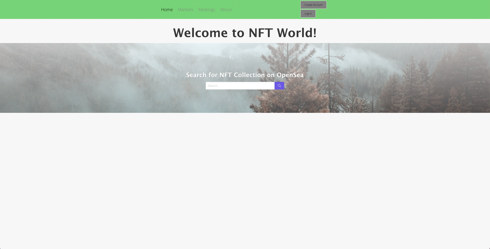

# NFT World

NFT World is a web-based platform to explore NFTs (non-fungible tokens) on the Ethereum, Solana, and Cardano blockchain. Built primarily with React.js, users can search for an NFT collection, discover various marketplaces that sell NFTs, and see the top collections ranked on statistics such as 7 day sales volume and floor prices.   

## Technology Used

NFT World is a full-stack application, with this repository containing the frontend development (see https://github.com/kawaharm/nft-world-backend for backend development). The frontend is built using React, Node, and Axios. The React framework generates the primary user interface. Node and Axios are used to communicate with the backend server to login/signup users, request API calls and retrieve NFT-related documents from the database (MongoDB). The OpenSea API is used to extract real-time data on NFT collections and assets. 

## How To Install
1. Fork and clone repository
2. Run `npm install` to install node packages
3. Set up `.env` file to access the server with the following:
    ```
    REACT_APP_SERVER_URL=
    ```

## Screenshots
Homepage
> 

Markets Page


Rankings Page


## Code Snippets


