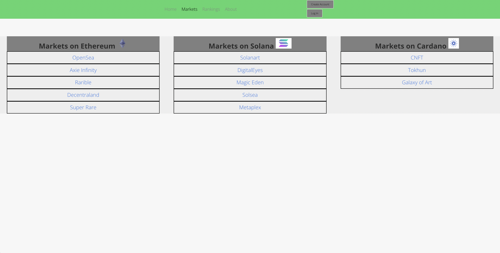
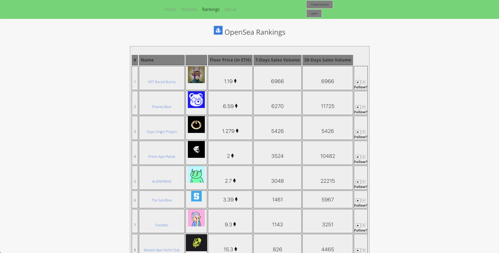

# NFT World

NFT World is a web-based platform to explore NFTs (non-fungible tokens) on the Ethereum, Solana, and Cardano blockchain. Built primarily with React.js, users can search for an NFT collection, discover various marketplaces that sell NFTs, and see the top collections ranked on statistics such as 7 day sales volume and floor prices.   

## Technology Used

NFT World is a full-stack application, with this repository containing the frontend development (see https://github.com/kawaharm/nft-world-backend for backend development). The frontend is built using React, Node, and Axios. The React framework generates the primary user interface. Node and Axios are used to communicate with the backend server to login/signup users, request API calls and retrieve NFT-related documents from the database (MongoDB). The OpenSea API is used to extract real-time data on NFT collections and assets. 

## How To Install

1. Fork and clone repository
2. Run `npm install` to install node packages
3. Set up `.env` file to access the server with the following:
    ```
    REACT_APP_SERVER_URL=http://nft-world-api.herokuapp.com/
    ```

## Screenshots
Homepage
> 

Markets Page
> 

Rankings Page
> 

## Code Snippets

`RankingContainer.js`

This React method sends an HTTP request to the server to retrieve all the `Collections` documents and store it in the `collections` state array.
```js
    // Access Collections Controller to retrieve NFT collections
    componentDidMount() {
        axios.get(`${REACT_APP_SERVER_URL}/collections`)
            .then((response) => {
                // Store NFT collections from database
                this.setState({
                    collections: response.data.collections
                })
            })
            .catch((error) => {
                console.log('ERROR', error);
            })
    }
```

To display the attributes of each collection on the Rankings page, a copy of the `collections` array is created, mapped to extract the necessary data, and sent to the OpenSeaRanking component.
```js
        // Create a new array that stores collections data and send to OpenSeaRanking Component 
        const displayCollections = this.state.collections.map((c, idx) => <OpenSeaRanking
            key={idx}
            index={idx}
            name={c.name}
            slug={c.slug}
            description={c.description}
            image_url={c.image_url}
            floor_price={c.floor_price}
            seven_day_sales={c.seven_day_sales}
            thirty_day_sales={c.thirty_day_sales}
            likedCollection={this.state.likedCollection}
        />);
```

`NftPage.js`

```js
    const { id } = useParams();
    const [assets, setAssets] = useState([]);
 
    useEffect(() => {
        // Call OpenSea API to retrieve assets from NFT collection
        // Limited to last 20 assets by sales date
        axios.get(`https://api.opensea.io/api/v1/assets?order_by=sale_date&order_direction=desc&offset=0&limit=20&collection=${id}`)
            .then((response) => {
                setAssets(response.data.assets);
            })
            .catch((err) => {
                console.log('ERROR hitting API: ', err);
            })
    }, []); // <-- Empty array in input so would only run on mount

    // Create a new array that stores assets data and send to NftAsset Component 
    const displayAssets = assets.map((a, idx) => {
        return <NftAsset
            key={idx}
            name={a.name}
            image_url={a.image_url}
            permalink={a.permalink}
            last_sale={a.last_sale.total_price}
            collection_image_url={a.collection.image_url}
            trait_type={a.traits.map(t => { return `${t.trait_type}, ` })}
            trait_value={a.traits.map(t => { return `${t.value}, ` })}
        />
    })
```
